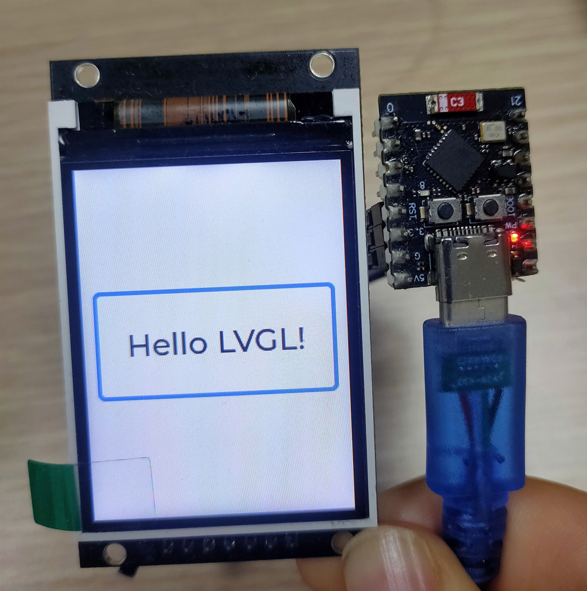

# ESP32C3mini LVGL ST7789 Demo

## Mô tả
Dự án này trình diễn cách sử dụng ESP32-C3 Mini để điều khiển màn hình ST7789 với thư viện Adafruit_ST7789 và hiển thị giao diện đồ họa bằng LVGL v9. Dự án sử dụng PlatformIO và framework Arduino.

## Tính năng
- Hiển thị giao diện LVGL trên màn hình ST7789 (240x320)
- Tăng kích thước chữ, có khung chữ nhật bao quanh label
- Có thể mở rộng thêm các widget LVGL khác

## Sơ đồ nối dây (theo platformio.ini)
| Tên tín hiệu | ESP32C3 Mini |
|--------------|-------------|
| TFT_CS       | GPIO10      |
| TFT_DC       | GPIO7       |
| TFT_RST      | GPIO6       |
| TFT_SCLK     | GPIO5       |
| TFT_MOSI     | GPIO4       |
| VCC, GND     | 3V3, GND    |

## Thư viện sử dụng
- [Adafruit_ST7789](https://github.com/adafruit/Adafruit-ST7735-Library)
- [lvgl](https://github.com/lvgl/lvgl)

## Cấu trúc dự án
```
platformio.ini         # Cấu hình PlatformIO, chân kết nối, build flags
src/
  main_lvgl.cpp        # Code chính LVGL + Adafruit_ST7789
  main.cpp             # (Có thể rename/xóa nếu chỉ dùng LVGL)
include/
lib/
lv_conf.h             # File cấu hình LVGL
```

## Hướng dẫn build & nạp
1. Cài đặt PlatformIO (trên VS Code)
2. Kết nối ESP32C3 Mini với máy tính
3. Mở thư mục dự án, build và upload:
   - Build: `PlatformIO: Build`
   - Nạp:  `PlatformIO: Upload`
4. Màn hình sẽ hiển thị giao diện LVGL mẫu



## Ghi chú
- Nếu gặp lỗi multiple definition, hãy chỉ giữ lại 1 file main_lvgl.cpp trong thư mục src.
- Có thể chỉnh sửa giao diện trong file `src/main_lvgl.cpp`.

## Branch EEZ Studio

Nếu bạn muốn phát triển giao diện với EEZ Studio, hãy tạo một branch mới:

```sh
git checkout -b "EEZ_Studio"
```

Tất cả code, file cấu hình, hoặc tài liệu liên quan đến EEZ Studio nên được commit vào branch này. Điều này giúp tách biệt code giao diện EEZ Studio với code LVGL/Arduino thuần.

Khi cần cập nhật README hoặc hướng dẫn riêng cho EEZ Studio, hãy bổ sung vào branch này.

---
Tác giả: Trần Văn Huynh
Ngày cập nhật: 22/05/2026
